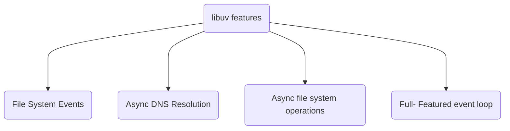

### Node.js Behind the Scenes

#### [V8](https://v8.dev/docs)
- Converts JS code into machine code so that machine can understand.


#### [libuv](https://libuv.org/)
- Opensource library with a strong focus on Asynchronous I/O written in c++.
- Libuv is a multi-platform support
library with a focus on async /O. It
was developed specially for Node.js



#### Other Dependencies
- **LIhttp:** Designed to not make any syscalls or allocations.
- **c-ares:** For some Asynchronous DNS requests.
- **OpenSSL:** Implementations of many Cryptographic functions.
- **Zlib:** For fast compression and decompression.

#### Thread
- Each unit capable of executing code is called a
thread.
- Node.js is single threaded, which means it can only do "one" thing at a time.

#### Event Loop
- The event loop will be generated in the thread
& the role of this loop is to schedule which
operations our thread should be performing
at any given point.

#### Callback 
- Callback is an asynchronous equivalent for a function.
- A callback function is called at the completion of a given task.
- Callback help us in preventing from the blocking of the code.
- Node makes heavy use of callbacks.
```javascript
javascript(someprocess, callback)
if (someprocess === "complete") { callback() }
```